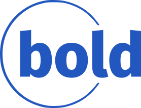

[.branding#logo]

:last-update-label!:

= Project Charter
:toc:
:toc-placement!:

:imagesdir: ./images
:icons: font

++++

++++

[.branding]
Project Title:: HealthyMe App Project
Project Start Date:: January 1, 2024
Projected End Date:: December 1, 2024
Budget Information:: Estimated Budget: $50,000

== Project Objectives
To develop a user-friendly mobile app that allows users to track their diet and exercise routines, aiming to launch by December 1, 2024.

== Scope Description
The app will include features for logging meals, tracking exercise, setting health goals, and viewing progress over time. Users can also share their achievements on social media and engage in a community forum.

== Key Stakeholders
* Project Team
* Client
* End-Users
* Investors

== Project Manager
* Name, contact information

== Major Deliverables
* Mobile App (iOS and Android Versions)
* User Manual
* Project Documentation including Business Analytical and Technical Design Documentation

== Acceptance Criteria
* The app should be easy to navigate and use without requiring a steep learning curve.
* The app should be delivered within the estimated budget and by the projected end date.
* The app should meet all the functional requirements as agreed upon with the client.

== Constraints
* Budget Limit: $50,000
* Project Deadline: December 1, 2024

== Assumptions
* Availability of all necessary resources on time.
* The project team will have continuous access to the client for clarifications and feedback.

== Risks
* Unanticipated technical challenges that may delay development.
* Fluctuations in project costs due to unforeseen market conditions.

== Communication Plan
* Weekly status updates via email.
* Monthly review meetings with the client and stakeholders.
* Emergency communication via phone.

== Approval
* Signatures of the Client, Project Manager, and other key stakeholders to officially authorize the project.

The undersigned acknowledge they have reviewed the Project Charter Document for the HealthyMe App Project and agree with the information presented within this document. 

[cols="2,2,2,2", options="header"]
|===
| Name
| Title
| Signature
| Date

| 
| 
| 
| 

| 
| 
| 
| 

| 
| 
| 
| 

| 
| 
| 
| 
|===

Any changes to the requirements specified in this document will be handled through the change control process.

