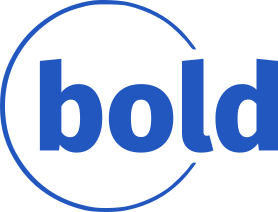

[.branding#logo]

:last-update-label!:

= User Stories Document
[.branding]
Project Title:: HealthyMe App Project
Project Start Date:: January 1, 2024
Projected End Date:: December 1, 2024
Budget Information:: Estimated Budget: $50,000

:toc:
:toc-placement!:
:toc-title: Table of Contents

:imagesdir: ./images
:icons: font

++++

++++

== Introduction

The HealthyMe App Project aims to provide a mobile platform for individuals to track and manage their health and fitness goals. Through an intuitive and user-friendly interface, users can log their daily activities, interact with a community of like-minded individuals, and receive encouragement to maintain a healthy lifestyle. The objective is to promote wellness, create a supportive community, and make health management accessible and enjoyable.

This User Stories Document is instrumental in translating the business objectives into functional requirements. By capturing the desired user interactions and functionalities in a user-centric format, this document helps to ensure that the development aligns with the end-users' needs and expectations. Each user story encapsulates a specific user goal, providing a basis for feature development and testing.

The user stories are categorized based on different user roles and functionalities, presenting a clear vision of the intended user experience. This structured approach aids in maintaining a user-focused development process, ensuring that the HealthyMe App is engaging, beneficial, and meets the project objectives.

== User Stories Index

[cols="1,1,1",options="header"]
|===
| User Story ID | User Role | Description
| 1 | New User | Register and set up a profile to personalize experience.
| 2 | Health-conscious User | Track daily steps to monitor physical activity.
| 3 | User | Log daily calorie intake to manage diet.
| 4 | Motivated User | Set and track health goals to improve health.
| 5 | Social User | Interact with other users in a community forum to share experiences and learn.
| 6 | Proud User | Share achievements on social media to showcase progress.
| 7 | Admin | Moderate the community forum to maintain a positive and respectful community environment.
|===

. User Registration and Profile Setup
* As a new user,
* I want to be able to register and set up my profile,
* So that I can personalize my experience.

. Daily Step Tracking
* As a health-conscious user,
* I want to track my daily steps,
* So that I can monitor my physical activity.

. Calorie Logging
* As a user,
* I want to log my daily calorie intake,
* So that I can manage my diet.

. Goal Setting
* As a motivated user,
* I want to set and track health goals,
* So that I can work towards improving my health.

. Community Interaction
* As a social user,
* I want to interact with other users in a community forum,
* So that I can share experiences and learn from others.

. Achievement Sharing
* As a proud user,
* I want to share my achievements on social media,
* So that I can showcase my progress.

. Admin Moderation
* As an admin,
* I want to moderate the community forum,
* So that a positive and respectful community environment is maintained.

== User Stories Details

=== User Registration and Profile Setup

* *As a* new user,
* *I want to* be able to register and set up my profile,
* *So that* I can personalize my experience.

*Acceptance Criteria:*

* User can register with an email address.
* User can set up a profile with a name, age, gender, and profile picture.

*Mockups:* 
[.image]
image::mockup-user-story1.png[User story 1,align="center"]

*Dependencies:* None

*Notes:*

* The registration process should be simple and intuitive to encourage users to join.
* Profile setup could include additional fields like fitness goals to further personalize the user's experience.

*Priority:* High

*Estimation:* 

* Development: 3 days
* Testing: 1 day

=== Daily Step Tracking

* *As a* health-conscious user,
* *I want to* track my daily steps,
* *So that* I can monitor my physical activity.

*Acceptance Criteria:*

* User can see the steps tracked automatically.
* User can manually enter steps if needed.

*Mockups:* 
[.image]
image::mockup-user-story2.png[User story 2,align="center"]

*Dependencies:* User Registration and Profile Setup

*Notes:*

* The step tracking feature should be easily accessible from the home screen.
* Integration with other fitness tracking devices or apps could be considered for automatic step tracking.

*Priority:* High

*Estimation:* 

* Development: 4 days
* Testing: 1 day

=== Goal Setting

* *As a* motivated user,
* *I want to* set and track health goals,
* *So that* I can work towards improving my health.

*Acceptance Criteria:*

* User can set goals related to step count, calorie intake, and other health metrics.
* User can track their progress towards these goals over time.
* The app provides notifications to encourage the user to meet their goals.

*Mockups:*
[.image]
image::mockup-user-story3.png[User story 3,align="center"]

*Dependencies:* User Registration and Profile Setup

*Notes:*

* The goal-setting feature should be flexible to accommodate a variety of health goals.
* Having a visual representation of progress towards goals can motivate users to stay on track.

*Priority:* High

*Estimation:* 

* Development: 4 days
* Testing: 2 days

=== Community Interaction

* *As a* social user,
* *I want to* interact with other users in a community forum,
* *So that* I can share experiences and learn from others.

*Acceptance Criteria:*

* User can post questions or share experiences in the community forum.
* User can reply to posts by other users.
* User can upvote or downvote posts and comments.

*Mockups:* 
[.image]
image::mockup-user-story4.png[User story 4,align="center"]

*Dependencies:* User Registration and Profile Setup

*Notes:*

* The community forum should have a friendly and intuitive interface to encourage interaction.
* It would be beneficial to have moderation features to ensure a positive and respectful community environment.

*Priority:* Medium

*Estimation:* 

* Development: 4 days
* Testing: 2 days

=== Achievement Sharing

* *As a* proud user,
* *I want to* share my achievements on social media,
* *So that* I can showcase my progress.

*Acceptance Criteria:*

* User can share predefined achievements on their social media profiles.
* User can customize the message they want to share.
* The app provides a link back to the app in the shared message.

*Mockups:* 
[.image]
image::mockup-user-story5.png[User story 5,align="center"]

*Dependencies:* User Registration and Profile Setup

*Notes:*

* The sharing feature should support popular social media platforms like Facebook, Twitter, and Instagram.
* Achievements could include milestones like reaching a fitness goal, or streaks like logging meals for a certain number of consecutive days.

*Priority:* Medium

*Estimation:* 

* Development: 4 days
* Testing: 1 day

=== Admin Moderation

* *As an* admin,
* *I want to* moderate the community forum,
* *So that* a positive and respectful community environment is maintained.

*Acceptance Criteria:*

* Admin can view all posts and comments in the community forum.
* Admin can delete inappropriate posts or comments.
* Admin can ban or suspend users who violate community guidelines.
* Admin can pin important posts to the top of the forum.

*Mockups:*
[.image]
image::mockup-user-story6.png[User story 6,align="center"]

*Dependencies:* User Registration and Profile Setup, Community Interaction

*Notes:*

* The moderation features should be easy to use to ensure timely moderation.
* Implementing a reporting feature could help the admin in identifying inappropriate content.

*Priority:* Medium

*Estimation:* 

* Development: 4 days
* Testing: 2 days

== Approval

The undersigned acknowledge they have reviewed the User Stories Document for the HealthyMe App Project and agree with the information presented within this document. 

[cols="2,2,2,2", options="header"]
|===
| Name
| Title
| Signature
| Date

| 
| 
| 
| 

| 
| 
| 
| 

| 
| 
| 
| 

| 
| 
| 
| 
|===

Any changes to the requirements specified in this document will be handled through the change control process.

